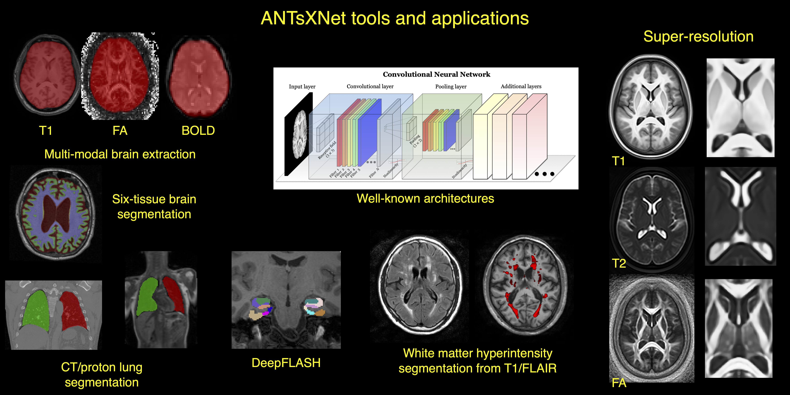

[](code_of_conduct.md)
[](https://pubmed.ncbi.nlm.nih.gov/33907199/)

# Advanced Normalization Tools for Deep Learning in Python (ANTsPyNet)

A collection of deep learning architectures and applications ported to the Python language and tools for basic medical image processing. Based on `keras` and `tensorflow` with cross-compatibility with our R analog [ANTsRNet](https://github.com/ANTsX/ANTsRNet/). ANTsPyNet provides three high-level features:

- A large collection of common deep learning architectures for medical imaging that can be initialized
- Various pre-trained deep learning models to perform key medical imaging tasks
- Utility functions to improve training and evaluating of deep learning models on medical images

<p align="middle">
  
</p>

## Installation

### Binaries

The easiest way to install ANTsPyNet is via pip.

```
python -m pip install antspynet
```

### From Source

Alternatively, you can download and install from source.

```
git clone https://github.com/ANTsX/ANTsPyNet
cd ANTsPyNet
python -m pip install . # or python setup.py install
```

## Quickstart

The core functionality that ANTsPyNet provides is the ability to initialize a Deep Learning model based on our large collection of model architectures specifically tailored for medical images. You can then train these initialized models using your standard `keras` or `tensorflow` workflows.

An example of initializing a deep learning model based on the is provided here:

```python
from antspynet.architectures import create_autoencoder_model
model = create_autoencoder_model((784, 500, 500, 2000, 10))
model.summary()
```

We also provide a collection of pre-trained models that can perform key medical imaging processing tasks such as brain extraction, segmentation, cortical thickness, and more. An example of reading a brain image using `ANTsPy` and then performing brain extraction using our pre-trained model in `ANTsPyNet` is presented here:

```python
import ants
import antspynet

t1 = ants.image_read(antspynet.get_antsxnet_data('mprage_hippmapp3r'))

seg = antspynet.brain_extraction(t1, modality="t1", verbose=True)
ants.plot(t1, overlay=seg, overlay_alpha=0.5)
```

## Resources

[ANTsPyNet Documentation](https://antsx.github.io/ANTsPyNet/)

[ANTsPyNet Tutorials](https://gist.github.com/ntustison/12a656a5fc2f6f9c4494c88dc09c5621#antsxnet)

## Collection Overview

The following is an overview of the available model architectures and pre-trained models that ANTsPyNet provides:

<details>
<summary>Architectures</summary>

### Image voxelwise segmentation/regression

- [U-Net (2-D, 3-D)](https://arxiv.org/abs/1505.04597)
- [U-Net + ResNet (2-D, 3-D)](https://arxiv.org/abs/1608.04117)
- [Dense U-Net (2-D, 3-D)](https://arxiv.org/pdf/1709.07330.pdf)

### Image classification/regression

- [AlexNet (2-D, 3-D)](http://papers.nips.cc/paper/4824-imagenet-classification-with-deep-convolutional-neural-networks.pdf)
- [VGG (2-D, 3-D)](https://arxiv.org/abs/1409.1556)
- [ResNet (2-D, 3-D)](https://arxiv.org/abs/1512.03385)
- [ResNeXt (2-D, 3-D)](https://arxiv.org/abs/1611.05431)
- [WideResNet (2-D, 3-D)](http://arxiv.org/abs/1605.07146)
- [DenseNet (2-D, 3-D)](https://arxiv.org/abs/1608.06993)

### Object detection

### Image super-resolution

- [Super-resolution convolutional neural network (SRCNN) (2-D, 3-D)](https://arxiv.org/abs/1501.00092)
- [Expanded super-resolution (ESRCNN) (2-D, 3-D)](https://arxiv.org/abs/1501.00092)
- [Denoising auto encoder super-resolution (DSRCNN) (2-D, 3-D)]()
- [Deep denoise super-resolution (DDSRCNN) (2-D, 3-D)](https://arxiv.org/abs/1606.08921)
- [ResNet super-resolution (SRResNet) (2-D, 3-D)](https://arxiv.org/abs/1609.04802)
- [Deep back-projection network (DBPN) (2-D, 3-D)](https://arxiv.org/abs/1803.02735)
- [Super resolution GAN](https://arxiv.org/abs/1609.04802)

### Registration and transforms

- [Spatial transformer network (STN) (2-D, 3-D)](https://arxiv.org/abs/1506.02025)

### Generative adverserial networks

- [Generative adverserial network (GAN)](https://arxiv.org/abs/1406.2661)
- [Deep Convolutional GAN](https://arxiv.org/abs/1511.06434)
- [Wasserstein GAN](https://arxiv.org/abs/1701.07875)
- [Improved Wasserstein GAN](https://arxiv.org/abs/1704.00028)
- [Cycle GAN](https://arxiv.org/abs/1703.10593)
- [Super resolution GAN](https://arxiv.org/abs/1609.04802)

### Clustering

- [Deep embedded clustering (DEC)](https://arxiv.org/abs/1511.06335)
- [Deep convolutional embedded clustering (DCEC)](https://xifengguo.github.io/papers/ICONIP17-DCEC.pdf)

</details>

<details>
<summary>Applications</summary>

- [MRI super-resolution](https://www.medrxiv.org/content/10.1101/2023.02.02.23285376v1)
- [Multi-modal brain extraction](https://pubmed.ncbi.nlm.nih.gov/33907199/)
  - T1
  - T1 ["no brainer"](https://github.com/neuronets/nobrainer)
  - FLAIR
  - T2
  - FA
  - BOLD
  - [T1/T2 infant](https://www.med.unc.edu/psych/research/psychiatry-department-research-programs/early-brain-development-research/)
- [Six-tissue Atropos brain segmentation](https://pubmed.ncbi.nlm.nih.gov/33907199/)
- [Cortical thickness](https://pubmed.ncbi.nlm.nih.gov/33907199/)
- [Brain age](https://academic.oup.com/brain/article-abstract/143/7/2312/5863667?redirectedFrom=fulltext)
- [HippMapp3r hippocampal segmentation](https://pubmed.ncbi.nlm.nih.gov/31609046/)
- [Sysu white matter hyperintensity segmentation](https://pubmed.ncbi.nlm.nih.gov/30125711/)
- [HyperMapp3r white matter hyperintensity segmentation](https://pubmed.ncbi.nlm.nih.gov/35088930/)
- [Hypothalamus segmentation](https://pubmed.ncbi.nlm.nih.gov/32853816/)
- [Claustrum segmentation](https://arxiv.org/abs/2008.03465)
- [Deep Flash](https://www.nature.com/articles/s41598-024-59440-6)
- [Desikan-Killiany-Tourville cortical labeling](https://pubmed.ncbi.nlm.nih.gov/33907199/)
- [Cerebellum segmentation, parcellation, and thickness](https://www.nature.com/articles/s41598-024-59440-6)
- MRI modality classification
- Lung extraction
  - [Proton](https://pubmed.ncbi.nlm.nih.gov/34227163/)
  - CT
- Lung pulmonary vessel segmentation
- [Functional lung segmentation](https://pubmed.ncbi.nlm.nih.gov/34227163/)
- [Neural style transfer](https://arxiv.org/abs/1508.06576)
- Image quality assessment
  - [TID2013](https://www.sciencedirect.com/science/article/pii/S0923596514001490)
  - [KonIQ-10k](https://ieeexplore.ieee.org/document/8968750)
- [Mixture density networks (MDN)](https://publications.aston.ac.uk/373/1/NCRG_94_004.pdf)

- [Training scripts](https://github.com/ntustison/ANTsXNetTraining)

</details>

<details>
<summary>Publications</summary>

- Nicholas J. Tustison, Michael A. Yassa, Batool Rizvi, Philip A. Cook, Andrew J. Holbrook, Mithra Sathishkumar, Mia G. Tustison, James C. Gee, James R. Stone, and Brian B. Avants. ANTsX neuroimaging-derived structural phenotypes of UK Biobank. _Scientific Reports_ 14, 8848 (2024). [(pubmed)](https://www.nature.com/articles/s41598-024-59440-6)

- Nicholas J. Tustison, Talissa A. Altes, Kun Qing, Mu He, G. Wilson Miller, Brian B. Avants, Yun M. Shim, James C. Gee, John P. Mugler III, and Jaime F. Mata. Image- versus histogram-based considerations in semantic segmentation of pulmonary hyperpolarized gas images. _Magnetic Resonance in Medicine_, 86(5):2822-2836, Nov 2021. [(pubmed)](https://pubmed.ncbi.nlm.nih.gov/34227163/)

- Andrew T. Grainger, Arun Krishnaraj, Michael H. Quinones, Nicholas J. Tustison, Samantha Epstein, Daniela Fuller, Aakash Jha, Kevin L. Allman, Weibin Shi. Deep Learning-based Quantification of Abdominal Subcutaneous and Visceral Fat Volume on CT Images, _Academic Radiology_, 28(11):1481-1487, Nov 2021. [(pubmed)](https://pubmed.ncbi.nlm.nih.gov/32771313/)

- Nicholas J. Tustison, Philip A. Cook, Andrew J. Holbrook, Hans J. Johnson, John Muschelli, Gabriel A. Devenyi, Jeffrey T. Duda, Sandhitsu R. Das, Nicholas C. Cullen, Daniel L. Gillen, Michael A. Yassa, James R. Stone, James C. Gee, and Brian B. Avants for the Alzheimer’s Disease Neuroimaging Initiative. The ANTsX ecosystem for quantitative biological and medical imaging. _Scientific Reports_. 11(1):9068, Apr 2021. [(pubmed)](https://pubmed.ncbi.nlm.nih.gov/33907199/)

- Nicholas J. Tustison, Brian B. Avants, and James C. Gee. Learning image-based spatial transformations via convolutional neural networks: a review, _Magnetic Resonance Imaging_, 64:142-153, Dec 2019. [(pubmed)](https://www.ncbi.nlm.nih.gov/pubmed/31200026)

- Nicholas J. Tustison, Brian B. Avants, Zixuan Lin, Xue Feng, Nicholas Cullen, Jaime F. Mata, Lucia Flors, James C. Gee, Talissa A. Altes, John P. Mugler III, and Kun Qing. Convolutional Neural Networks with Template-Based Data Augmentation for Functional Lung Image Quantification, _Academic Radiology_, 26(3):412-423, Mar 2019. [(pubmed)](https://www.ncbi.nlm.nih.gov/pubmed/30195415)

- Andrew T. Grainger, Nicholas J. Tustison, Kun Qing, Rene Roy, Stuart S. Berr, and Weibin Shi. Deep learning-based quantification of abdominal fat on magnetic resonance images. _PLoS One_, 13(9):e0204071, Sep 2018. [(pubmed)](https://www.ncbi.nlm.nih.gov/pubmed/30235253)

- Cullen N.C., Avants B.B. (2018) Convolutional Neural Networks for Rapid and Simultaneous Brain Extraction and Tissue Segmentation. In: Spalletta G., Piras F., Gili T. (eds) Brain Morphometry. Neuromethods, vol 136. Humana Press, New York, NY [doi](https://doi.org/10.1007/978-1-4939-7647-8_2)

</details>

<details>
<summary>Acknowledgements</summary>

- We gratefully acknowledge the support of the NVIDIA Corporation with the donation of two Titan Xp GPUs used for this research.

- We gratefully acknowledge the grant support of the [Office of Naval Research](https://www.onr.navy.mil) and [Cohen Veterans Bioscience](https://www.cohenveteransbioscience.org).

</details>

## Contributing

If you encounter an issue, have questions about using ANTsPyNet, or want to request a feature, please feel free to [file an issue](https://github.com/ANTsX/ANTsPyNet/issues). If you plan to contribute new code to ANTsPyNet, we would be very appreciative. The best place to start is again by opening an issue and discussing the potential feature with us.

## License

The ANTsPyNet package is released under an [Apache License](https://github.com/ANTsX/ANTsPyNet/blob/master/LICENSE.md).
